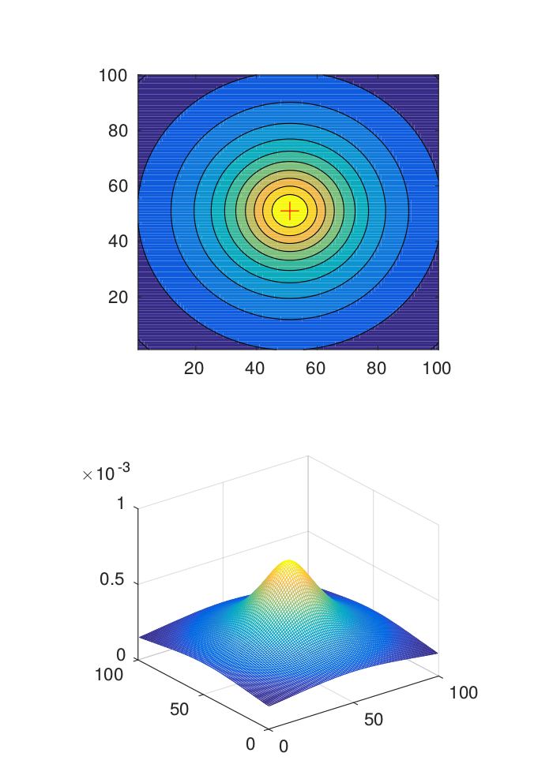

# Machine Learning Engineer Nanodegree
## Capstone Proposal
Jiri Vrany
Jun 9th, 2017
## Using deep learning for anomaly detection in geophysical survey

The usual result of any geophysical survey is a dataset with the description of features hidden under the Earth surface. Analysis of such dataset requires a lot of skills and specific knowledge. Precise analysis take long time even for a skilled geophysicist.  There are lot of situations, where we a need to do a quick survey on site. For example  the detection of damaged infrastructure after an earthquake or flooding. The rescue team needs to be able to do a quick survey, with the instant result if possible. Some level of precision can be traded for speed in such situation. 
Recent research shows that the methods of computer vision can be used for analysis of potential field provided by the gravimeter. This includes the machine learning methods. The potential field model of gravitation anomaly [1] can be visualized as a 2D or 3D image. The final goal, beyond the scope of this project is to create a fast but reliable anomaly detection and classification model. 
 
### Problem Statement

Gravity anomaly is the difference between expected and observed gravity value. The anomaly indicates, that under the earth surface are objects with different density. The contrast of densities can show us heavy objects or cavities. Various anomalies generate the various potential field. In this project, I would like to create the anomaly (object) type classifier.
 
### Datasets and Inputs

    Traditional geophysical surveys do not provide enough data to train the machine learning models. Either the datasets are small or not available for public or both. Thus the artificial dataset with several anomaly types was created. This dataset is based on the models described in [1].  The real field data do not correspond with the artificial model, but can be interpolated to the same format with the gridding process. 
 
Dataset consists 47890 synthetical models for the area of size 100x100 meters. The sampling step in measuring is 1 m. Modeled anomalies are:  spherical anomaly, vertical cylinder, horizontal cylinder and rectangular prism.  All anomalies have random size, and each model contains a random level of noise. Each of the models can be represented with 100x100x1 tensor with a known label. Dataset also contains a subset of the random noise only data - without any modeled anomaly.



*Fig. 1 - data example - vertical cylinder, radius 5 m, situated in the middle of the
area, located 15 m under the surface, zero noise.* 

### Solution Statement

I would like to use methods of deep learning, especially the Convolutional Neural Networks (CNN) to create the classifier. The CNN are a very effective solution for finding patterns in the images and for the image classification. They should work well for the potential field too. I would like to explore several CNN architectures, to achieve best possible accuracy and training speed on test data. 

### Benchmark Model
I will use two benchmark model. First one will be the simple linear model Wxi+b. The second one will be older model published in [2]. 

This is classic computer vision model, with methods such as edge and line detection. First, the original data are normalized and thresholded at 9 levels from 0.1 of maximum to 0.9 of maximum to get 9 black and white images. At the level 0.5, the linear structures and circular regions are searched in the algorithm using the Hough transform and centroid detection. When objects are detected, the algorithm runs detection in the other BW images.

The horizontal cylinder is detected, when 2 parallel lines in the same direction are running through the image. If a circular structure is detected from level O.9 to O.1 with always the same center, the hypothesis of other anomaly types is selected. According to the radius of the circular structure at level 0.5 is calculated the field for these anomalies. The most similar shape of the field is selected as anomaly candidate.
 
I will compare the accuracy, training time and prediction time with the benchmark. All models will be trained on the same dataset. 
 
### Evaluation Metrics

The main evaluation metrics will be the classification accuracy.  A classification accuracy is a number of correct predictions from all predictions made by the model. 
For the accuracy computation, I will use the algorithm described in [3]. First,  compute the correct predictions tensor:

```
correct_prediction = tf.equal(tf.argmax(y,1), tf.argmax(y_,1))
```

Then I will cast this tensor of booleans to float32 and compute the accuracy as the mean value of the tensor.

```
accuracy = tf.reduce_mean(tf.cast(correct_prediction, tf.float32))
```

Secondary evaluation metric will be the training and prediction time. I will compute the actual time difference between start and end using python time module. 

### Project Design
 
I will use Python 3 with Numpy, Scipy, Pandas and TensorFlow packages to solve the project. 
As a first step, I will convert the dataset to the Tensorflow records. Currently, the data are in text files, each file is labeled by anomaly type and location. This format was required for the other experiments with the dataset. I will grab the label from the file name, and store it to the record together with the dimensions and the potential field. Then I have to look closer to the data and check if the normalization will help in the future classifier training.  The potential values are different from the traditional image data. Still, the normalization may help to get better results. 
 
I will shuffle and then split the data to the train validation and test set before training. I will use 80% of data for training, 10% for validation and 10% for a final test. Then I will train the basic linear benchmark model. In this step, I will create necessary tools for loading the TensorFlow records and test if all software packages are working as expected. 
 
I'm planning to test several CNN architectures. I will start with CNN that I created during the DeepLearning project - digit recognizer. That means that I will start with three convolutional layers and two fully connected layers with dropout. Then I start experiments with the architecture modifications.

During the training of model, I will measure accuracy on the validation set. I will tune the model hyperparameters until the model will start to minimize the error and increase the accuracy. I will also record the training time on the whole dataset. 
 
 


### Sources
[1]: Salem, A: Multi-deconvolution analysis of potential field data, Journal
of Applied Geophysics, 2011, Vol. 74, Issue 2-3, Pages 151-156.

[2]: Koskova Triskova L., Novak J.: Application of edge and line detection to
detect the near surface anomalies in potential data, 2013, International con-
ference on Pattern recognition Applications and Methods 2013, Barcelona,
poster and paper 
 
[3] TensorFlow manual: Deep MNIST for Experts, 2017