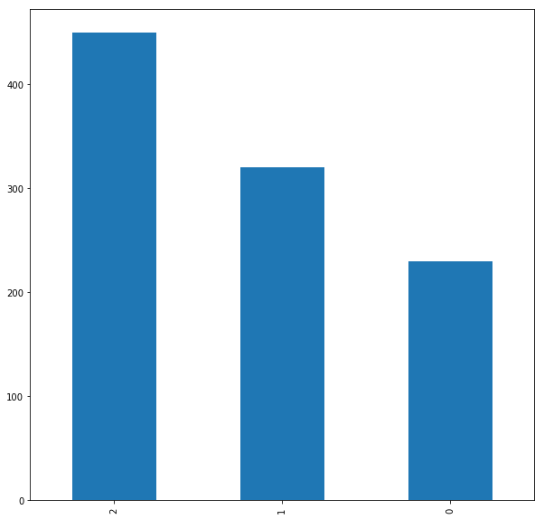
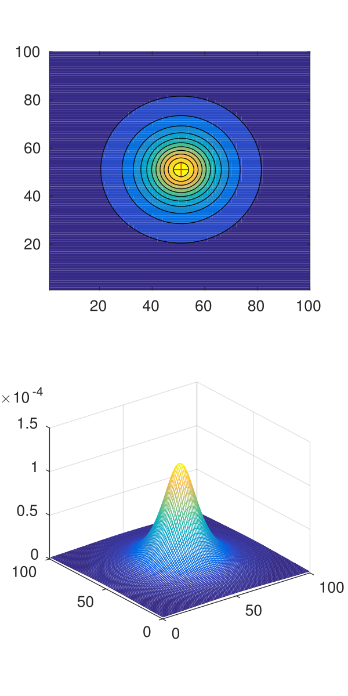
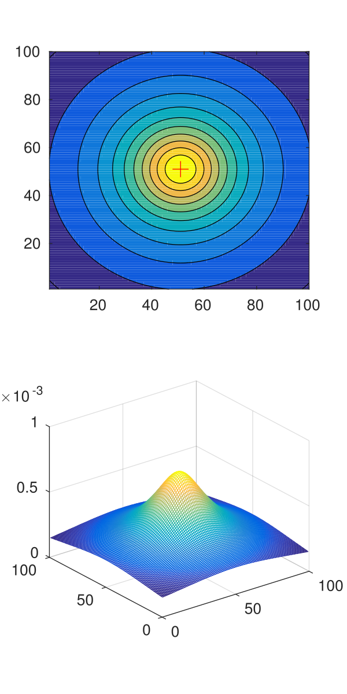
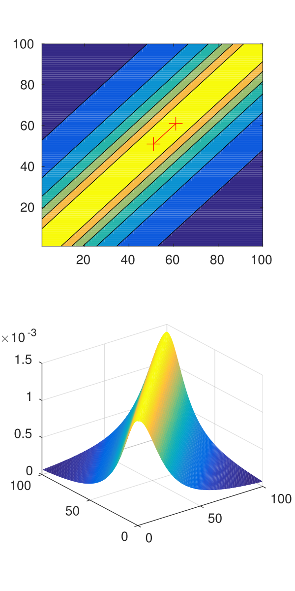
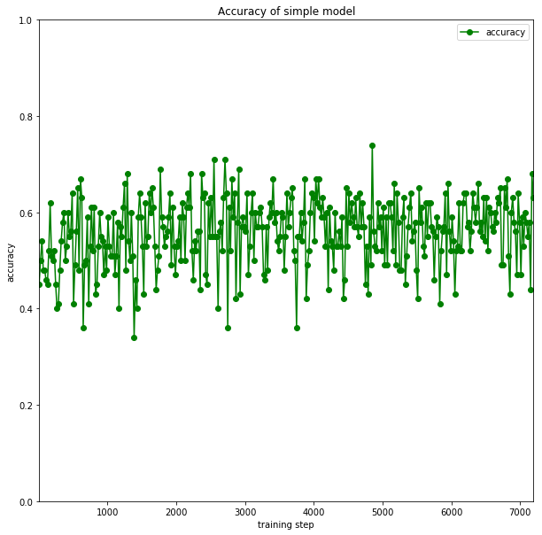
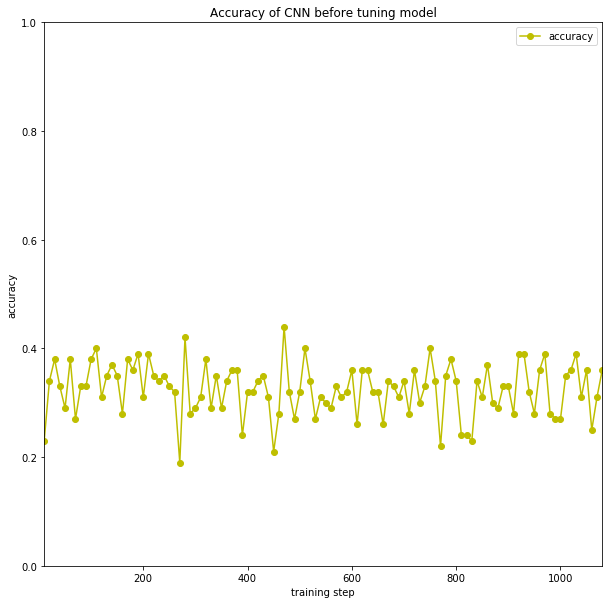
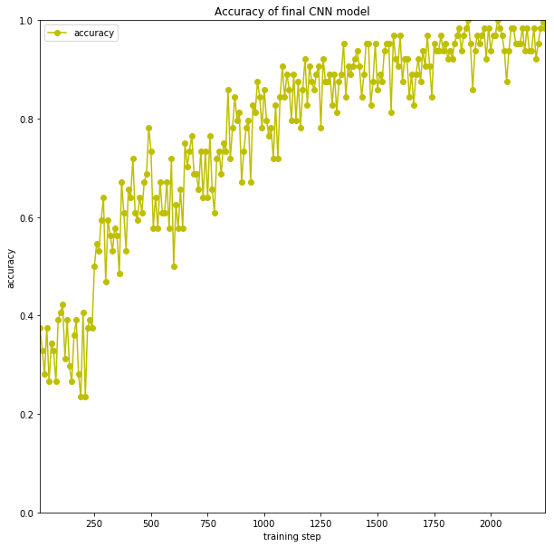

# Using deep learning for anomaly detection in geophysical survey
## Capstone Project
Jiri Vrany
September 11th, 2017
## I. Definition
### Project Overview

The usual result of any geophysical survey is a dataset with the description of features hidden under the Earth surface. Analysis of such dataset requires a lot of skills and specific knowledge. The precise analysis takes a long time even for a skilled geophysicist.  
On the other hand, there are situations, where we a need to do a quick survey on site. For example the detection of damaged infrastructure after an earthquake or flooding. The rescue team needs to be able to do a quick survey, with the instant result if possible. Some level of precision can be traded for speed in such situation. 

Recent research shows that the methods of computer vision can be used for analysis of potential field provided by the gravimeter. This includes the machine learning methods. The potential field model of gravitation anomaly [1] can be visualized as a 2D or 3D image. The final goal, beyond the scope of this project, is to create a fast but reliable anomaly detection and classification model. 

### Problem Statement
Gravity anomaly is the difference between expected and observed gravity value. The anomaly indicates, that under the earth surface are objects with different density. The contrast of densities can show us heavy objects or cavities. Various anomalies generate the various potential field. 
The goal of this project is to explore if the methods of deep learning can be used to create fast and efficient classifier of the anomaly type.  
Metrics
We used the classification accuracy as a primary evaluation metric.  A classification accuracy is a number of correct predictions from all predictions made by the model. 
For the accuracy computation, We used the algorithm described in [3]. 

First,  compute the correct predictions tensor:

```
correct_prediction = tf.equal(tf.argmax(y,1), tf.argmax(y_,1))
```

Then cast this tensor of booleans to float32 and compute the accuracy as the mean value of the tensor.

```
accuracy = tf.reduce_mean(tf.cast(correct_prediction, tf.float32))
```

The second method used for analysis of the result was the confusion matrix. The confusion matrix is often used for visualization of classification algorithm result. An element of the matrix represents the number of testing samples classified as a certain class. We can easily see where the algorithm performs well or where it misclassify some data.  

## II. Analysis
### Data Exploration

Traditional geophysical surveys do not provide enough data to train the machine learning models. Either the datasets are small or not available for public or both. 

That is why the artificial dataset with several anomaly types was created. This dataset is based on the physical models described in [1].  The real field data do not correspond with the artificial model directly, but they can be interpolated to the same format with the gridding process. 
 
The created dataset consists 29992 synthetical models for the area of size 100x100 meters. The sampling step in measuring is 1 m. Modeled anomalies are  spherical anomaly, vertical cylinder, and horizontal cylinder.

All anomalies have a random size and random position inside the area. Each of the models can be represented with 100x100x1 tensor with a known label. 

For each anomaly type, 10000 samples were generated. However, the total number of samples is slightly lower. The generator script creates the file name with the sample from the anomaly parameters. And if the script generates the same random parameters twice, the previous file is simply overwritten. 

The original dataset was split to the testing, validation and training part. The testing set contains 1000 randomly selected samples and has been completely taken off the training/evaluation process. 



*Fig. 1 - Distribution of anomaly type in testing dataset. 0 = Sphere, 1 = Vertical c., 2 = Horizontal c.* 

### Exploratory Visualization
Each anomaly generates specific potential field based on its gravity effect. This effect is proportional to the density of the anomaly object. 



*Fig. 2 - Example of Anomaly type 0 = Sphere. Density contrast
1 gcm −3 , radius 5 m, situated in the middle of the area, located 15 m under the
surface.* 




*Fig. 3 - Example of Anomaly type 1 = Vertical Cylinder. density contrast 1 gcm −3 , radius 5 m,
situated in the middle of the area, located 15 m under the surface.* 




*Fig. 4 - Example of Anomaly type 0 = Horizontal Cylinder. density contrast 1 gcm −3 , parallel with
the surface, running diagonally, radius 5 m, located 15 m under the surface.* 

Looking to the examples of each anomaly we can see, that the potential field for horizontal cylinder has a specific shape, and can be clearly distinguished from the other two anomalies. On the other hand, the difference between the sphere and the vertical cylinder is not that clear. The field generated by the sphere is leaner and more oblong - the peak is steeper than for the vertical cylinder. With the random size of anomaly field generated by larger sphere can be easily misclassified as the field generated by a smaller vertical cylinder. This is the place where some human or machine expertise is required. 

### Algorithms and Techniques

The Convolutional Neural Networks (CNN) are considered as a state-of-the-art in the field image recognition. In many research papers and real situations, they are reported to work well for finding patterns in the images and for the image classification. Detail description of CNN can be found lecture notes of A. Karpathy [KARPATHY]

Let's briefly recap that typical CNN is composed of several layers. The input layer in our case is the potential field represented by a 2D array. In general, it can be an image in RGB or another format, once again in form of 2D array. The input layer is connected to several convolutional layers, typically more than two.  In convolutional layer, we apply set of filters to the input to generate new features.  Next, the output of convolutional layer is used as the input of pooling layer. Pooling layer contains the activation function and the downsampling operation. 

After several convolution and pooling steps, the fully connected layer is used for reduction the size of data to a number of classes. One or more fully connected layers can be used. The final step of the CNN is the classification layer. In this layer we assign the class belong probability to the results of the fully connected layer. As for normal neural network, we use a backpropagation algorithm to adjust the weights of the neurons in the network and to let the network learn. 

The basic implementation of layers, optimization, and neural network training is available in many open-source libraries such as Tensor Flow, Torch or Keras. However, there is still a lot of parameters that must be properly selected and tuned before CNN starts learning efficiently. The most important parameters tuned in this project were:
* **The number of hidden layers**. The number of layers is a basic parameter of each neural network architecture. It should correspond with the number of input parameters, amount of training data,  the complexity of classification problem and the training algorithm. There is no general golden rule but start with the simple network and add layers if necessary seems to be a reasonable strategy.  
* **Size of convolutional filters**. The size of neuron receptive field (or filter size) depends on the type of data that we want to classify. If small and local features are important for classification of images we should use smaller filters (5x5, 3x3). If larger features are more significant larger filters (9x9, 11x11) can be more effective. The recent trend is to use more convolutional layers with smaller filters because it is more memory efficient. For our data larger features are more important, because smaller features in the field are mostly caused by residual noise. Therefore larger filters should work better.
* **Minibatch size**.  Mini batches are used to reduce the computation cost of training. For large dataset is even impossible to train the network on the whole dataset. It is reported that smaller mini batches help to create a more generalized model and to converge faster [https://arxiv.org/abs/1609.04836].  
* **Network Optimization method**. The classic method for updating network weights is stochastic gradient descent. After 2012 several advanced algorithms were introduced, and Adam optimizer [4](https://arxiv.org/abs/1412.6980) seems to be the best one of them [5](https://arxiv.org/abs/1609.04747). It is able to adapt the learning ratio during the training and it is a default optimizer in Tensor Flow. It has several parameters for tuning but initial learning rate is probably still the most important one.   
* **Dropout**. Dropout is the method used to reduce network overfitting introduced in AlexNet paper [6](https://papers.nips.cc/paper/4824-imagenet-classification-with-deep-convolutional-neural-networks.pdf). In each training step randomly chosen number of neurons is set to zero and this helps the network to learn more robust and general patterns in the data. The dropout is typically used on fully connected layers. In our architecture, there is one such layer with dropout.

### Benchmark
The results of CNN based classifier were compared with two benchmark models. 

The first model was the simple linear model Wxi+b with softmax layer. This model was trained on similar dataset as CNN. 



*Fig. 5 - Accuracy of simple linear model* 

| Anomaly type             |   S | VC  |  HC |
| -----------------------  | --- | --- | --- |
| Sphere (S)               |  71 | 129 |  30 |
| Vertical cylinder (VC)   |  80 | 190 |  50 |
| Horizontal cylinder (HC) | 180 | 230 |  40 |

*Table 1.  - confusion matrix of simple model.*

The accuracy of the simple model was oscilating around 50% during the training process. However on the training set the simple model failed and it's result are similar to the random guessing. We can see that the model makes lot of errors for each anomaly type, not only for the expected Sphere vs Vertical cylindre.

The second model was originally published in [2].  This model was created by classic methods of computer vision such as edge and line detection. First, the original data are normalized and thresholded at 9 levels from 0.1 of maximum to 0.9 of maximum to get 9 black and white images. At the level 0.5, the linear structures and circular regions are searched in the algorithm using the Hough transform and centroid detection. When objects are detected, the algorithm runs detection in the other BW images.

The horizontal cylinder is detected, when 2 parallel lines in the same direction are running through the image. If a circular structure is detected from level O.9 to O.1 with always the same center, the hypothesis of other anomaly types is selected. According to the radius of the circular structure at level 0.5 is calculated the field for these anomalies. The most similar shape of the field is selected as anomaly candidate. 

| Anomaly type             |   S | VC  |  HC | NC  |
| -----------------------  | --- | --- | --- | --- |
| Sphere (S)               | 175 | 97  |  1  |  47 |
| Vertical cylinder (VC)   |   0 | 295 |  1  | 144 |
| Horizontal cylinder (HC) |   0 |   0 | 244 |  6  |


*Table 2.  - confusion matrix of simple model. NC = not classified.*


Compared to the machine learning models, there is no need of training for this model. The model also has one difference - if it has one more extra “class” - not classified. As we can see in the final confusion table, the model was uncertain about the sphere / vertical cylinder difference. A lot of vertical cylinders were not classified too. 

## III. Methodology
### Data Preprocessing

#### Noise filtering

Each sample in the dataset contains some level of randomly created noise. This noise was generated to make the artificial data more realistic. However, the experiments with data during development of original model [2] proved, that the noise must be filtered out. Without filtering the algorithm was unable to detect the edges in the data sample at all.  Several methods of filtering were tested and finally, the adaptive Wiener filter was selected as the preprocessing denoising filter. 

After a set of failed attempts to train the network on noised data, we decide to use the same denoising filter in this project. Denoising will increase learning algorithm performance and allow to compare the results of CNN with benchmark algorithm. 

#### Normalization

Normalization of data samples is a common preprocessing method for neural networks. It makes all data values to be in the same range. This usually improves the convergence of weights and biases in a neural network. We used the Euclidean (L2) norm for all samples in the dataset.

#### Dataset augmentation 

We use the horizontal and vertical reflection of original data to create more training samples for a neural network. Usually, only the horizontal reflection is used for image data, because it preserves the visual context of the image. However, for the potential field, we can use the vertical flip too, because of this only transfer the anomaly to the different part of the grid. 

### Implementation

Preprocessing, simple model and the convolutional neural network were implemented in Python with Numpy, Scipy, Sklearn, Pandas, and Tensor Flow libraries. 

Our final model has two convolutional layers. Both are using RELU activation function. The first layer has the convolutional filter of size 7x7, the depth of the filter is 128.  The second layer has the 5x5 filter with depth 256. Both convolutional layers are followed by max pooling layer. This max pooling layer is using SAME padding and 2x2 kernel. The weights of both layers are initialized by truncated normal with standard deviation 0.001.

After two convolutional layers are one fully connected layer. This layer has 1042 nodes and RELU activation function. It is followed by drop out layer with 40% dropout rate. The final layer of our model is the softmax layer. 

The model is available in the project repository in two version. First file initial_cnn.py contains the initial version, second final_cnn.py contains the final tuned model described above. 

The data are fed to the model by tensor flow queue. A mini batch of 64 samples is used in the final architecture. After each 10 training steps, the accuracy is measured on the validation data set.

Preprocessing script transforms the data from the generated txt files to Tensor Flow Record format. Each file is denoised by wiener filter from scipy.signal package. Then normalized with L2 norm from sklearn preprocessing module. Finally, the normalized file is horizontally and vertically flipped and all three new files are stored in TF Record format. The preprocessing script is available in the project repository as preprocess.py. 

The generator script for the data was created by Lenka Koskova Triskova as a part of her research. It is written in Python 2.7 and is available in the GitHub repository with this report as generator.py. 

Simple linear benchmark model is implemented using Tensor Flow and is available in project repository as simple_model.py.

### Refinement
The initial architecture of model was similar to the final architecture, but several parameters were tuned to achieve better results. We started with 5x5 filter size, the learning rate for optimizer was 0,001 and the minibatch size 150 which was the biggest size that fit into the memory of available GPU. The depth of the filter on the first layer was 32 and 64 on the second layer. With this setting, the network did not learn at all and its precision was close to random guessing. 



*Fig. 6 - Accuracy of CNN model before tuning of parameters.* 

We began the refinement of parameters with the increase of the filter depth to 128 on first and 256 on the second layer. Then increase of filter size on the first convolutional layer to 7x7, and decrease the minibatch size to 64. With those settings, the model starts to learn with good accuracy.

## IV. Results
### Model Evaluation and Validation
The final model is stored in the final_cnn.py file in the project repository. On previously unseen dataset it was capable to achieve accuracy between 98-100% with testing on different parts of the dataset. During the project preparation and proposal we expected, that the final model architecture will be more complex and deeper. But this simple model behaved well. 



*Fig. 7 - Accuracy of final CNN model.* 

During the tuning and debugging process, we trained the model several times with different training and validation data set. Each time with the random shuffle of the dataset before the split of training and validation set. We assume that the model is stable and trustable for this dataset.

### Justification
The final model achieved better results than both benchmarks. This is important especially in the case of second benchmark model. The CNN is capable to distinguish between the vertical cylinder and sphere and to classify all the testing examples. This is a significant improvement of existing method and it gives a good base for further experiments.

| Anomaly type            |   S | VC  |  HC |
| ----------------------- | --- | --- | --- |
| Sphere (S)              | 220 |   0 |  10 |
| Vertical cylinder (VC)  |   0 | 320 |   0 |
| Horizontal cylinder (HC) |     |  14 | 436 |

*Table 3.  - confusion matrix of final model.*

## V. Conclusion
### Reflection
In this project, we created convolutional neural network model for classification of geophysical anomaly. This machine learning model achieved better results than the benchmark model based on the computer vision methods. 
The new model was trained directly on the potential field data, without conversion of the dataset to the images. This can be one of the reasons why the model behaves better. In the transformation of the field of the image, some information is lost. 
It has been proven many times, that the CNN based models perform better in the field of classification and therefore the results of the project are as expected. However, in the beginning, we thought that the CNN model will be capable to learn even from unnormalized noisy data, and this was not true. We spent a lot of time with different network architectures and parameters tuning, however without any good results. The final way to working model was in better preprocessing - the normalization and denoising turn out to be the right way.
The further research in the geophysical anomaly detection should be based on CNN models. Stronger classifier opens new possibilities and further experiments with the more complex dataset with more than one anomaly or more anomaly types will be possible. 
### Improvement
In the beginning of the project we thought about more than three anomaly classes. But because we have the results of the benchmark model only for those three it was not necessary to create additional data samples. This would be the interesting improvement of the project, and it can help to create the more robust model for the real situations.
This project was proof of concept which turns to the success. Now we can start to classify more anomalies, but also start to work on the detection of the anomaly position, the different levels of noise and other improvements of this basic model. 

### Sources
[1]: Salem, A: Multi-deconvolution analysis of potential field data, Journal
of Applied Geophysics, 2011, Vol. 74, Issue 2-3, Pages 151-156.

[2]: Koskova Triskova L., Novak J.: Application of edge and line detection to
detect the near surface anomalies in potential data, 2013, International con-
ference on Pattern recognition Applications and Methods 2013, Barcelona,
poster and paper 
 
[3] TensorFlow manual: Deep MNIST for Experts, 2017

[4] Diederik P. Kingma, Jimmy Ba: Adam: A Method for Stochastic Optimization, 3rd International Conference for Learning Representations, San Diego, 2015

[5] Sebastian Ruder: An overview of gradient descent optimization algorithms

[6] Alex Krizhevsky and Sutskever, Ilya and Hinton, Geoffrey E: ImageNet Classification with Deep Convolutional Neural Networks, Advances in Neural Information Processing Systems 25, 2012


